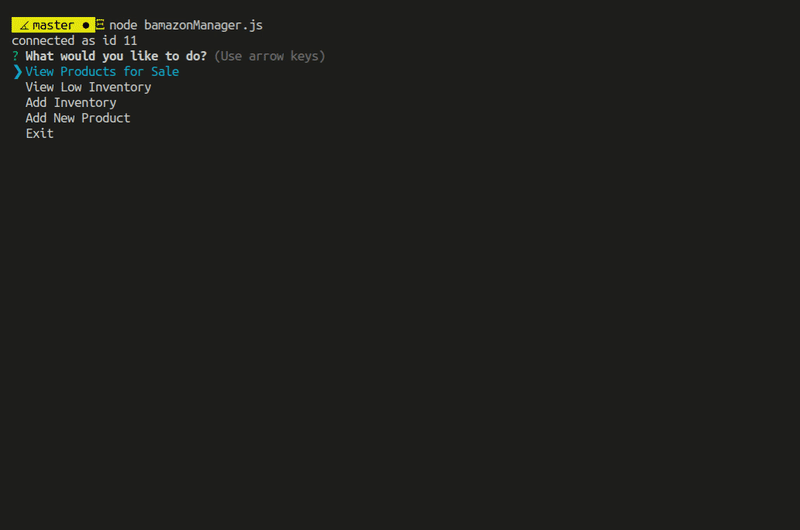

<p align="center">
  
</p>

Bamazon is not very unlike Amazon, in the sense that it enables consumers to buy a bevy of bitchin products but-- 
## BAM! 

It can all be done STRAIGHT FROM THE COMMAND LINE WITH NODE!! Never before has such bin-convenience been available! 

`bamazon` is a MySQL database that contains two tables: `products` and `departments`. The products table contains columns for 
```   * item_id (unique id for each product)
   * product_name (Name of product)
   * department_name
   * price (cost to customer)
   * stock_quantity (how much of the product is available in stores)
   ```
   # bamazonCustomer.js

<p align="center">
  
</p>

Customers who wish to access the database in order to make a purchase (after cloning this repository) will run:

`$ node bamazonCustomer.js`

The main menu presents the option to `See Inventory` which prints a sweet table that shows which items are offered, as well as their respective prices and availability.  

The second option allows the user to `Place Order`, which will prompt the user to input the item # of the item they wish to purchase, followed by a prompt asking how many they would like to purchase. Once all the input is collected a message will print stating how many of which item was purchased and the total spent.

The user is free to continue browsing and making further purchases at their leisure, until they wish to exit. Who needs one click buy buttons when recursive prompts are at your fingertips?!? :bowtie: :thumbsup:

# bamazonManager.js

<p align="center">
  
</p>

For the back end's backend, bmanagement can access all of the tools they will need to bmanhandle the databamaintenance by running 

`$ node bamazonManager.js`

Just as the customer they will have the option to view the data in the `products` table by selecting `View Products for Sale`. 

The next option, `View Low Inventory`, returns a table with any items whose `stock_quantity < 5`. 

The `Add Inventory` option will prompt for the ID# of the item to restock, followed by another prompt for the amount, and finally displays a message indicating which product and how many were successfully added to the database.

Lastly, `Add New Product` will prompt for a name, department, price and stock quantity, and then add a new row into the `products` table. When complete it prints a line repeating this information along with the new ID# of the product. 

# bamazonSupervisor.js

